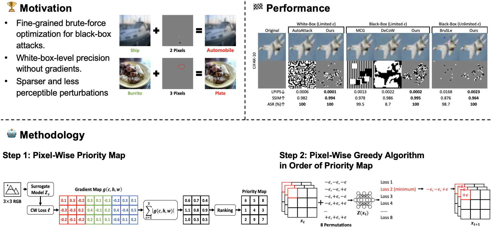

# GreedyPixel: Fine-Grained Black-Box Adversarial Attack Via Greedy Algorithm

[Publication](https://doi.org/10.1109/TIFS.2025.3630890) | [PDF](https://arxiv.org/pdf/2501.14230)



Deep neural networks are highly vulnerable to adversarial examples, which are inputs with small, carefully crafted perturbations that cause misclassification—making adversarial attacks a critical tool for evaluating robustness. Existing black-box methods typically entail a trade-off between precision and flexibility: pixel-sparse attacks (e.g., single- or few-pixel attacks) provide fine-grained control but lack adaptability, whereas patch- or frequency-based attacks improve efficiency or transferability, but at the cost of producing larger and less precise perturbations. We present **GreedyPixel**, a fine-grained black-box attack method that performs **brute-force-style, per-pixel greedy optimization** guided by a surrogate-derived priority map and refined by means of query feedback. It evaluates each coordinate directly **without any gradient information**, guaranteeing monotonic loss reduction and convergence to a coordinate-wise optimum, while also yielding near white-box-level precision and pixel-wise sparsity and perceptual quality. On the CIFAR-10 and ImageNet datasets, spanning convolutional neural networks (CNNs) and Transformer models, GreedyPixel achieved state-of-the-art success rates with visually imperceptible perturbations, effectively bridging the gap between black-box practicality and white-box performance.

## Main Requirements
  * **Python (3.9.32)**
  * **torch (2.1.2+cu118)**
  * **torchvision (0.16.2+cu118)**
  * **numpy (1.26.4)** - numpy < 2 
  * **[RobustBench](https://github.com/RobustBench/robustbench) (1.1)** - providing target and surrogate models
  * **Google Cloud Vision (3.10.2)** - only for attacking API
  * **AWS Rekognition (1.40.28)** - only for attacking API
  
  The versions in `()` have been tested.

## Installation
```
pip install -r requirements-gpu.txt
```
or
```
pip install -r requirements-cpu.txt
```

## Models
The checkpoints will be automtically downloaded.

| Dataset | Architecture | Configuration | Comment |
|:---:|:---:|:---:|:---:|
| CIFAR-10 | PreActResNet-18 | Wong2020Fast | Surrogate |
| CIFAR-10 | WideResNet-28-10 | Standard | Target |
| ImageNet | ConvNeXt-L | Singh2023Revisiting_ConvNeXt-L-ConvStem | Surrogate |
| ImageNet | ResNet-50 | Standard_R50 | Target |
| ImageNet | ViT_Base_Patch16_224 | ViT | Target |

## GreedyPixel Attack on CIFAR-10 and ImageNet
```
from greedypixel import GreedyPixel
```
```
attack = GreedyPixel(
    target,
    surrogate,
    eps,
    args.max_query,
    args.early_stop
    )
x_adv, query = attack.attack(x,y)
```
### Demo
CIFAR-10:
```
python attack_model.py --eps 4 --max_query 10000 --surrogate Wong2020Fast --early_stop --target Standard --data cifar10 --input imgs/cifar10/ --output outputs
```
ImageNet:
```
python attack_model.py --eps 4 --max_query 20000  --surrogate Singh2023Revisiting_ConvNeXt-L-ConvStem --early_stop --target ViT --data imagenet --input imgs/imagenet/ --output outputs
```
| Argument | Type | Default | Description |
| -------- | ---- | ------- | ----------- |
| `--eps` | `float` | `4` | **Perturbation budget**. Interpreted as `epsilon/255`. Controls the maximum allowed pixel perturbation. |
| `--max_query` | `int` | `20000` | **Maximum query cost**. Stops the attack when this number of queries is reached. |
| `--surrogate` | `str` | `None` | **Surrogate model** to compute gradient maps. If `None`, random map is used. |
| `--early_stop` | `flag` | `False` | **Early stopping**. If set, the attack stops immediately once the predicted label changes. |
| `--target` | `str` | **(required)** | **Target model** to attack. Choose from: [Models](#models) and [RobustBench](https://github.com/RobustBench/robustbench). |
| `--batch_size` | `int` | `None` | Batch size depends on memory. |
| `--data` | `str` | `"cifar10"` | Dataset name. Choose from: `cifar10`, `imagenet`,  |
| `--input` | `str` | **(required)** | Directory of inputs. |
| `--output` | `str` | **(required)** | Directory where results will be saved (e.g., adversarial examples, logs). |
| `--start_idx` | `int` | `0` | start file (index). |
| `--end_idx` | `int` | `10` | end file (index + 1). |

## GreedyPixel Attack on Commercial Online Vision APIs
```
python attack_API.py --eps 255 --max_query 400 --surrogate Singh2023Revisiting_ConvNeXt-L-ConvStem --api google --top_n 5 --input imgs/imagenet/00000_974.png --output outputs
```
| Argument | Type | Default | Description |
| -------- | ---- | ------- | ----------- |
| `--eps` | `float` | `255` | **Perturbation budget**. Interpreted as `epsilon/255`. Controls the maximum allowed pixel perturbation. |
| `--max_query` | `int` | `400` | **Maximum query cost**. Stops the attack when this number of queries is reached. |
| `--surrogate` | `str` | `None` | **Surrogate model** to compute gradient maps. If `None`, random map is used. |
| `--early_stop` | `flag` | `False` | **Early stopping**. If set, the attack stops immediately once the predicted label changes. |
| `--api` | `str` | **(required)** | **Target API** to attack. Choose from: `google`, `aws`, `azure`. |
| `--top_n` | `int` | `5` | Focus only on the top-`n` predictions returned by the API. |
| `--data` | `str` | `"imagenet"` | Dataset name (currently only `imagenet` supported). |
| `--input` | `str` | **(required)** | Path to the input image file. |
| `--output` | `str` | **(required)** | Directory where results will be saved (e.g., adversarial examples, logs). |

## Citation
```
@article{wang2025greedypixel,
  title={Greedypixel: Fine-grained black-box adversarial attack via greedy algorithm},
  author={Wang, Hanrui and Chang, Ching-Chun and Lu, Chun-Shien and Leckie, Christopher and Echizen, Isao},
  journal={IEEE Transactions on Information Forensics and Security},
  year={2025},
  volume={20},
  pages={12080-12095},
  doi={10.1109/TIFS.2025.3630890}
}
```

## Contact
If you have any questions about our work, please do not hesitate to contact us by email.

Hanrui Wang: hanrui_wang@nii.ac.jp
